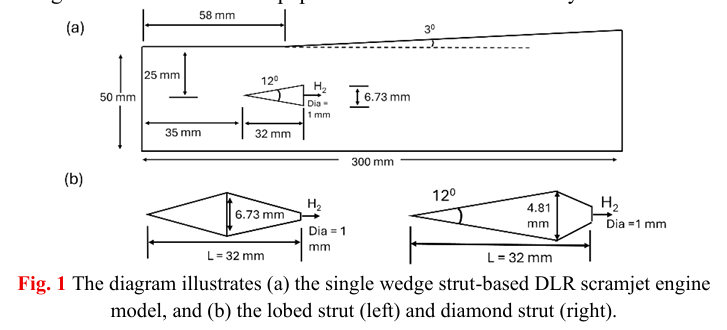
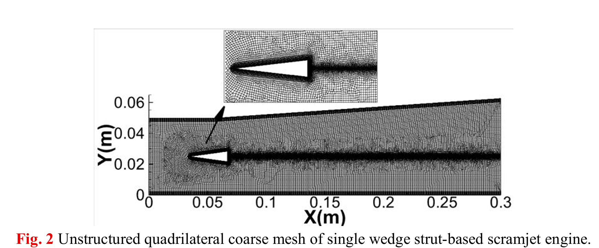
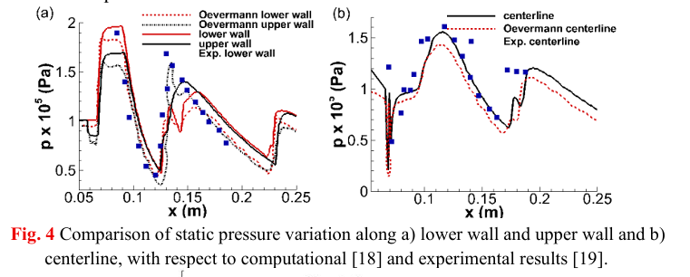
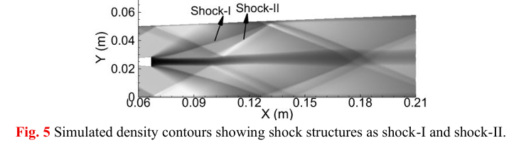
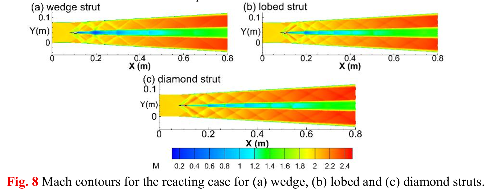
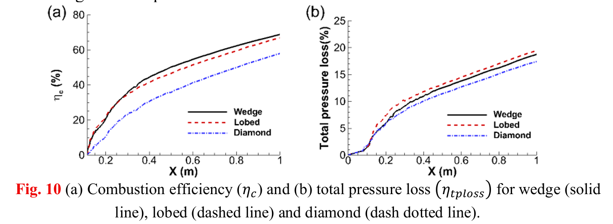

# CFD Analysis of Hydrogen-Fueled Scramjet Injector Geometries Using ANSYS Fluent

**Published Undergraduate Research**

**Domain:** Computational Fluid Dynamics (CFD) | Aerospace Propulsion | Scramjet Combustion | Compressible Flow

---

## Overview

This repository presents my published undergraduate research on the numerical investigation of hydrogen-fueled scramjet injector geometries using **Computational Fluid Dynamics (CFD)**.

The research investigates the aerodynamic and combustion performance of three different injector configurations—**Wedge**, **Lobed**, and **Diamond** struts—inside a hydrogen-fueled scramjet combustor. Numerical simulations were performed using **ANSYS Fluent** to analyze the influence of injector geometry on shock-wave formation, turbulent mixing, combustion efficiency, and total pressure loss.

The project combines concepts from **Compressible Flow**, **Gas Dynamics**, **Supersonic Combustion**, **Hypersonic Propulsion**, and **Computational Fluid Dynamics**, demonstrating the application of numerical simulations for aerospace propulsion system design.

This repository contains the published research paper together with detailed technical documentation describing the complete simulation methodology, numerical setup, engineering analysis, and future research directions.

---

# Research Objectives

The primary objectives of this research were:

- Investigate the influence of injector geometry on scramjet combustor performance.
- Compare wedge, lobed, and diamond strut injectors.
- Study compressible flow inside a hydrogen-fueled combustor.
- Analyze shock-wave formation generated by different injector geometries.
- Evaluate hydrogen-air mixing characteristics.
- Compare combustion efficiency.
- Compare total pressure loss.
- Identify the injector configuration providing the best overall engineering performance.

---

# Computational Geometry

<p align="center">

</p>

**Figure 1.** Computational model of the single wedge strut-based DLR scramjet combustor together with the lobed and diamond injector geometries investigated during this research.

---

# Computational Mesh

<p align="center">

</p>

**Figure 2.** Unstructured quadrilateral computational mesh used for the numerical simulations. Mesh refinement was introduced around the injector and expected shock interaction regions to accurately capture compressible flow features.

---

# Model Validation

<p align="center">

</p>

**Figure 3.** Validation of the numerical model through comparison of static pressure variation with previously published computational and experimental results. The agreement confirms the reliability of the adopted CFD methodology.

---

# Density Contours (Shock Structures)

<p align="center">

</p>

**Figure 4.** Density contours illustrating the formation of primary and secondary oblique shock waves inside the combustor. Shock structures significantly influence pressure recovery, hydrogen-air mixing, and combustion characteristics.

---

# Mach Number Distribution

<p align="center">

</p>

**Figure 5.** Mach number contours for wedge, lobed, and diamond injectors illustrating the influence of injector geometry on supersonic flow behavior and shock-wave interactions.

---

# Vorticity Distribution

<p align="center">

</p>

**Figure 6.** Z-vorticity contours demonstrating vortex generation downstream of each injector configuration. Enhanced vortex formation promotes rapid hydrogen-air mixing but may also increase aerodynamic losses.

---

# Performance Comparison

<p align="center">

</p>

**Figure 7.** Comparison of combustion efficiency and total pressure loss for wedge, lobed, and diamond injector geometries. The figure summarizes the overall aerodynamic and combustion performance of each injector.

---

# Major Findings

The CFD investigation led to the following conclusions:

- The **Wedge Strut** provided the best balance between combustion efficiency and pressure recovery.
- The **Lobed Strut** generated stronger vortices and improved hydrogen-air mixing but resulted in higher total pressure losses.
- The **Diamond Strut** produced comparatively weaker vortex structures, preserving pressure but reducing mixing effectiveness and combustion efficiency.
- Injector geometry strongly influences shock-wave formation, turbulent mixing, compressible flow behavior, and overall scramjet combustor performance.

---

# Software Used

- ANSYS Fluent
- ANSYS DesignModeler / SpaceClaim
- ANSYS CFD-Post

---

# Engineering Concepts

This project integrates concepts from multiple aerospace engineering disciplines:

- Computational Fluid Dynamics (CFD)
- Compressible Flow
- Gas Dynamics
- Supersonic Combustion
- Hydrogen Fuel Injection
- Aerospace Propulsion
- Turbulence Modeling
- Shock-Wave Analysis
- Numerical Simulation
- Finite Volume Method (FVM)

---

# Repository Structure

```text
Scramjet-Injector-CFD/
│
├── README.md
├── LICENSE
├── .gitignore
├── CITATION.cff
│
├── paper/
│   └── Published_Paper.pdf
│
├── docs/
│   ├── Project_Summary.md
│   ├── Methodology.md
│   ├── Simulation_Setup.md
│   ├── Results.md
│   └── Future_Work.md
│
├── images/
│   ├── geometry.png
│   ├── mesh.png
│   ├── validation.png
│   ├── density-contour.png
│   ├── mach-contour.png
│   ├── vorticity-contour.png
│   └── performance-comparison.png
│
└── presentation/
```

---

# Documentation

The repository contains detailed technical documentation describing every stage of the research.

| Document | Description |
|----------|-------------|
| Project_Summary.md | Background, motivation, objectives, and engineering significance |
| Methodology.md | Complete CFD workflow and research methodology |
| Simulation_Setup.md | Geometry, mesh generation, governing equations, solver configuration, and numerical setup |
| Results.md | Technical discussion of pressure, Mach number, density, vorticity, combustion efficiency, and injector comparison |
| Future_Work.md | Potential research extensions, optimization strategies, and future directions |

---

# Published Paper

The complete published research paper is available in the **paper** directory.

```text
paper/
└── Published_Paper.pdf
```

---

# Research Skills Demonstrated

- Computational Fluid Dynamics (CFD)
- ANSYS Fluent
- Aerospace Propulsion
- Hydrogen Combustion
- Compressible Flow Analysis
- Shock-Wave Analysis
- Turbulence Modeling
- Numerical Simulation
- Scientific Research
- Technical Documentation

---

# Future Scope

Possible extensions of this research include:

- Three-dimensional CFD simulations
- Large Eddy Simulation (LES)
- Direct Numerical Simulation (DNS)
- AI-assisted injector optimization
- Alternative fuel investigations
- Fluid-Structure Interaction (FSI)
- Experimental validation
- Thermal stress analysis
- High Mach number investigations

---

# Author

**Afroz Ahmed**

M.Tech Aerospace Engineering

Indian Institute of Technology Madras

**Research Interests**

- Computational Fluid Dynamics
- Aerospace Propulsion
- Hypersonic Flow
- Nonlinear Finite Element Analysis
- Scientific Computing

---

## Citation

If you find this repository useful for academic or research purposes, please cite the published paper available in the `paper/` directory.

---

## License

This repository is released under the MIT License.
